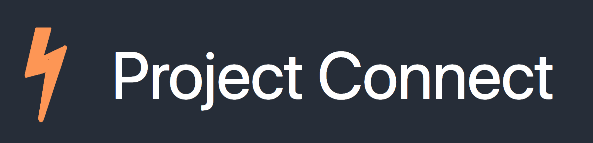

# project-connect

> connecting people with programming projects



Project connect is a NodeJS web application built as the final project for CS375 at Drexel.
It's purpose is to connect programmers with others that are looking for help on their projects.

## how to run

To run the server on port 3000:

```
node src/app.js
```

## folder structure

The folder structure is based on the conventions found in [this article](https://www.terlici.com/2014/08/25/best-practices-express-structure.html)

## built with

- Node.js
  - express
  - mysql
  - fuse (fuzzy search)

## group members

- Martin Kraus
- Marykate Owsiany
- Kat Dearstyne
- Owen Brooks

*Note: the Github profile for each member can be found under contributors in this repo*

## screenshots

In order to test, sample project data was loaded using the [top starred projects on github](https://www.kaggle.com/chasewillden/topstarredopensourceprojects)

*login view*


*main page view*


*project connect view*


*project search view*


*project view*

